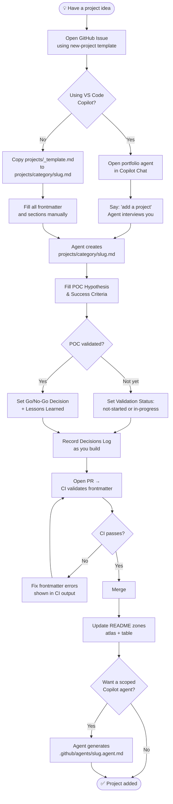

# Contributing to the Agentic Portfolio

## Add-a-Project Workflow



---

## Using the Portfolio Agent (recommended)

Open the **portfolio** agent mode in VS Code Copilot Chat (select `portfolio` from the agent picker).

| Say this | What happens |
|---|---|
| `add a project` | Guided interview → creates project file → updates README → offers agent generation |
| `validate [project] POC` | Checks hypothesis + success criteria completeness, reports pass/warn/fail |
| `update status of [project] to complete` | Updates frontmatter `status` + appends to `status_history` + updates README emoji |
| `record a decision for [project]` | Appends a row to that project's Decisions Log table |

---

## Manual Steps (without the agent)

1. **Copy the template**
   ```
   cp projects/_template.md projects/{work|personal}/{slug}.md
   ```
2. **Fill frontmatter** — all required fields: `title`, `category`, `status`, `summary`. See `_template.md` for the full list.
3. **Fill sections** — What It Is, POC Hypothesis & Validation, What I Built, Architecture, Skills Demonstrated, Status & Next Steps, Decisions Log, Links.
4. **Reference skills** — use tags from [`SKILLS-CATALOG.md`](SKILLS-CATALOG.md).
5. **Open a PR** — CI runs `validate_projects.py` and catches frontmatter errors.
6. **Update README** — replace the content between the `<!-- PROJECTS-ATLAS-START/END -->` and `<!-- PROJECTS-TABLE-START/END -->` markers to include your project.

---

## POC Hypothesis Guide

Every project should have a hypothesis statement that makes the POC falsifiable:

```
"I believe that [approach/solution] achieves [outcome] as measured by [metric]."
```

**Examples:**

> "I believe that routing MCP calls through Azure APIM achieves compliant OAuth 2.0 token validation as measured by a passing OBO token exchange without any credential storage in application code."

> "I believe that instrumenting Azure AI Foundry agents with OpenTelemetry achieves full span visibility across the invoke_agent → chat → execute_tool hierarchy as measured by correlated traces appearing in Application Insights within 30 seconds."

**Success Criteria** should be concrete checkboxes you can definitively tick or leave empty — not vague goals.

**Validation Status** lifecycle: `not-started` → `in-progress` → `validated` or `invalidated`

---

## Decisions Log Guide

Record every significant architectural or technical decision as a row in the project's `## Decisions Log` table. The goal is to have a record you can look back on — especially useful when a decision turns out to be wrong.

| Column | What to write |
|---|---|
| **Date** | YYYY-MM-DD |
| **Context** | What situation or constraint prompted this decision? |
| **Decision** | What was decided? (be specific — include the alternative considered if notable) |
| **Consequences** | What does this enable or constrain going forward? |

**Example row:**

| Date | Context | Decision | Consequences |
|------|---------|----------|--------------|
| 2026-01-15 | APIM doesn't natively support RFC 8414 discovery | Added a dedicated `/oauth/discovery` Container App endpoint proxied through APIM | Adds a service to maintain; enables full spec compliance without APIM custom domain hacks |

---

## Status Lifecycle

```
idea → in-progress → complete
                  → paused → in-progress (resume)
                           → archived
```

Update `status` and append to `status_history` whenever status changes. The `status_history` array is append-only.
