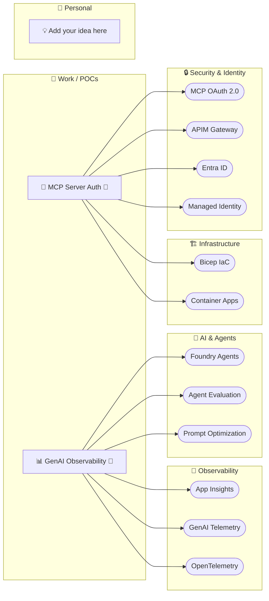

# Rodanthi Alexiou — Agentic Dev Portfolio

> Building at the intersection of AI, cloud infrastructure, and creative technology.  
> Microsoft AI partner enablement by day · exploring agentic software at the edges.

---

## Projects & Skills Atlas

> Projects (boxes) connect to the skills they use (pills). Blue = work/POC, green = personal, gray = idea.  
> Updated as projects are added — [add yours here](#add-a-project).

---

## Projects

| Project | Type | Status | Tech | Key Skills | Links |
|---------|------|--------|------|-----------|-------|
| [MCP Server Auth](projects/work/mcp-server-auth.md) | 💼 Work | 🔄 In Progress | Python · Bicep · FastAPI | MCP OAuth, APIM, Entra ID, Managed Identity | [repo ↗](https://github.com/rodanthi-alexiou/roda-agentic-workshop) |
| [GenAI Observability](projects/work/observability.md) | 💼 Work | 🔄 In Progress | Python · OpenTelemetry | App Insights, Foundry Agents, GenAI Telemetry | [repo ↗](https://github.com/rodanthi-alexiou/roda-agentic-workshop) |

> **Add a project**: [Open a GitHub Issue](../../issues/new?template=new-project.yml) — fill the form, and the project entry is auto-created.  
> Or copy [`projects/_template.md`](projects/_template.md) and open a PR.

---

## Skills I've Built

### 🔒 Security & Identity
| Skill | What I can build |
|-------|-----------------|
| **MCP OAuth 2.0 + APIM** | Full OAuth gateway: discovery (RFC 8414/8707), PKCE, OBO token exchange, dynamic client registration |
| **Entra ID** | M2M Client Credentials, user-delegated OBO flows, MSAL integration, multi-app registration patterns |
| **Managed Identity** | Passwordless auth between Azure services; RBAC assignment automation via Bicep |
| **APIM Policy Engine** | JWT validation, rate limiting, MCP-aware gateway policies, consent flows, AI gateway patterns |

### 🤖 AI & Agents
| Skill | What I can build |
|-------|-----------------|
| **Azure AI Foundry Agents** | End-to-end agent lifecycle: create, evaluate, optimize prompts, deploy to production |
| **Agent Evaluation** | Dataset curation from traces, batch eval, KPI tracking, eval trending over time |
| **Prompt Optimization** | Automated prompt optimizer workflows on Foundry; A/B comparison against eval datasets |
| **MCP Tool Integration** | HostedMCPTool, function tools, Graph API tools; stateless server design |

### 📡 Observability & Telemetry
| Skill | What I can build |
|-------|-----------------|
| **App Insights Instrumentation** | SDK setup, custom events, dependency tracking, alert rules |
| **GenAI Semantic Conventions** | OpenTelemetry spans for invoke_agent → chat → execute_tool hierarchy |
| **Distributed Tracing** | End-to-end trace correlation across agents, tools, and Azure backends |

### 🏗️ Infrastructure as Code
| Skill | What I can build |
|-------|-----------------|
| **Bicep IaC** | Modular Bicep: APIM, Container Apps, Cosmos DB, Key Vault, Azure OpenAI, Monitor |
| **Azure Container Apps** | Consumption tier, scale-to-zero, system-assigned Managed Identity, CI/CD pipeline |
| **azd (Azure Developer CLI)** | Project scaffolding, environment management, multi-stage deployment |

### 🌐 API & Protocol
| Skill | What I can build |
|-------|-----------------|
| **Model Context Protocol (MCP)** | Stateless MCP server design, Streamable HTTP transport, Foundry tool integration |
| **Azure API Management** | AI gateway, OAuth Authorization Server, MCP proxy, full policy authoring |
| **GitHub Copilot Agents** | Multi-stage agent pipelines (Onboarding → Architect → Builder); skills library |

---

## What I've Shipped

A living record of concrete things I've built — updated as projects complete.

- ✅ Full MCP OAuth 2.0 gateway on Azure APIM with Entra ID — JWKS validation, OBO token exchange, RFC 8414/8707 discovery endpoints
- ✅ Stateless MCP server on Azure Container Apps with Managed Identity (zero credentials in code)
- ✅ 8 Bicep infrastructure modules: APIM, Container Apps, CosmosDB, KeyVault, OpenAI, Storage, Monitor, Entra OBO stack
- ✅ GenAI telemetry pipeline: MAF workflow → OpenTelemetry → App Insights with full agent span hierarchy
- ✅ GitHub Copilot 3-stage agent pipeline: Onboarding → Architect → Builder
- ✅ 26-skill Copilot skills library covering Azure AI, infra, security, cost, and operations domains
- ✅ APIM policy set: authorize, consent, oauth-callback, token, register, protected-resource-metadata

---

## Currently Building

**🔐 MCP Server Auth** — Closing 6 gaps in MCP spec compliance (OAuth discovery endpoints, PKCE, dynamic client registration via Cosmos DB). Targeting a complete, ISV-ready reference implementation.

---

## About

I build reference implementations that Azure partners can learn from and reuse. Currently focused on agentic AI patterns — how to secure them, observe them, and make them production-ready.

- **Day job**: Microsoft AI partner enablement, technical demo builder
- **Stack**: Python · Bicep · FastAPI · Azure AI Foundry · MCP Protocol · Azure APIM
- **Approach**: Start with the hard problems (auth, observability, IaC) and ship working code
- **GitHub**: [rodanthi-alexiou](https://github.com/rodanthi-alexiou)

---

## Add a Project

Two ways to add a project to this hub:

1. **Via GitHub Issue** (lowest friction): [Open New Project Issue](../../issues/new?template=new-project.yml)
2. **Via PR**: Copy [`projects/_template.md`](projects/_template.md), fill it in, open a PR

See [SKILLS-CATALOG.md](SKILLS-CATALOG.md) for the full list of skills to reference in your project entry.
